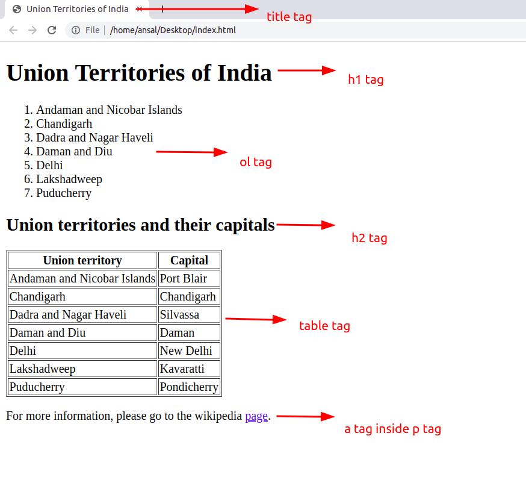

# List of Assignments

## Week 1

### Day 3: Git commit and push

Remember to change your default branch to `dev` before proceeding.

1. Create a folder named `day03` inside `week01`.
2. Create a file named `why_i_want_to_be_a_programmer.txt` inside the `day03` folder.
3. Write a short note in the file on why you want to be a programmer.
4. Commit the final changes and push to your repository.

> Solution session: _day-0_
>
> Due day: _day-0_

### Day 4: Creating an HTML page

1. Create a folder named `day04` inside `week01`.
2. Create a file named `programming-language-museum.html` inside the `day04` folder.
3. Write appropriate html code to achieve a page which looks like the image below.


> Solution session: _day-1_
>
> Due day: _day-1_

### Weekly Test: Create an html document which looks like the provided image

1. You should create a folder called `weekly-test` inside `week01` and put your HTML file inside it.
2. You have to use the exact tags as mentioned in the screenshot below.



> Due day: _day-3_

----------
## Week 2

### Day 1: Create a webpage about yourself

1. Create a page about you with `html` and `css` having:
    1. A heading with your name.
    2. A short paragraph about you.
    3. A list of your favourite movies.
2. Put your files under `assignments` > `week02` > `day01`.

> Solution session: _day-0_
>
> Due day: _day-0_

### Day 2: Create a webmail page


1. Create a webmail page which has three sections:
    1. The left one is for navigation and contains links for Inbox, Sent, Drafts & Trash. You can use an un-ordered list to do that.
    2. The right box is a table of emails with coloumns for From, Subject & Date.
    3. The bottom one is for placing ads.
2. You can use sizes, colors, fonts, etc according to your choice.
3. Put your files under `assignments` > `week02` > `day02`.

> Solution session: _day-0_
>
> Due day: _day-0_

### Day 3: Create a company web page using Bootstrap 4

Home page

About Us page

Contact Us page


1. Do not use any custom css styles.
2. Use Bootstrap grid (rows and columns).
3. You are free to replace text content.
4. Put your files under `assignments` > `week02` > `day03`.

> Solution session: _day-0_
>
> Due day: _day-0_

### Day 5: Even numbers in descending order

1. Write a Javascript function that displays even numbers in descending order.
2. Start from `100` and end at `2`.
3. Sample output:
```
100
98
96
.
.
.
2
```
4. No HTML or CSS required.
5. Put your file under `assignments` > `week02` > `day03`.

> Solution session: _day-0_
>
> Due day: _day-0_
